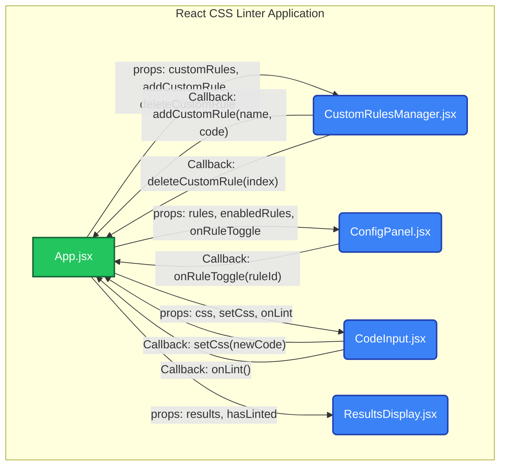

# React CSS Linter

This is a web-based CSS linter application built with React and Vite. It uses the [CSSLint](https://github.com/CSSLint/csslint) library to validate CSS code, providing a powerful and customizable tool for developers to check their stylesheets for errors and enforce coding conventions.

## Features

* **Direct Code Input**: Paste CSS code directly into a text area for quick validation.
* **File Upload**: Upload a CSS file (`.css`) from your local machine for linting.
* **Rule Configuration**: Interactively enable or disable specific linting rules from a comprehensive list.
* **Custom Rule Manager**: Extend the linter's capabilities by adding your own custom linting rules written in JavaScript.
* **Persistent Custom Rules**: Your custom rules are automatically saved to your browser's localStorage, so they are available every time you load the app.
* **Modern UI**: The application features a clean, responsive interface built with Tailwind CSS.

## Component Architecture

The application is built around a central App component that manages the state and logic. It passes data and functions down to child components, which are responsible for specific parts of the UI. The following diagram illustrates the flow of data and events between the components:



## Project Structure

```text
/
├── public/
│   └── vite.svg
├── src/
│   ├── assets/
│   │   └── icons.jsx
│   ├── components/
│   │   ├── CodeInput.jsx
│   │   ├── ConfigPanel.jsx
│   │   ├── CustomRulesManager.jsx
│   │   └── ResultsDisplay.jsx
│   ├── data/
│   │   └── defaults.js
│   ├── hooks/
│   │   └── useScript.js
│   ├── App.jsx
│   ├── index.css
│   └── main.jsx
├── .eslintrc.cjs
├── .gitignore
├── index.html
├── package.json
├── postcss.config.js
├── tailwind.config.js
└── vite.config.js
```

## Getting Started

### Prerequisites

* Node.js (v18 or later recommended)
* npm or yarn

### Installation

Clone the repository or download the files.

Navigate to the project directory:

```bash
cd css-linter
```

### Install the dependencies

```bash
npm install
```

### Running the Development Server

To start the Vite development server, run:

```bash
npm run dev
```

The application will be available at <http://localhost:5173> (or the next available port).

### Building for Production

To create a production-ready build of the application, run:

```bash
npm run build
```

The optimized static files will be placed in the `dist/` directory. You can preview the production build locally by running:

```bash
npm run preview
```
